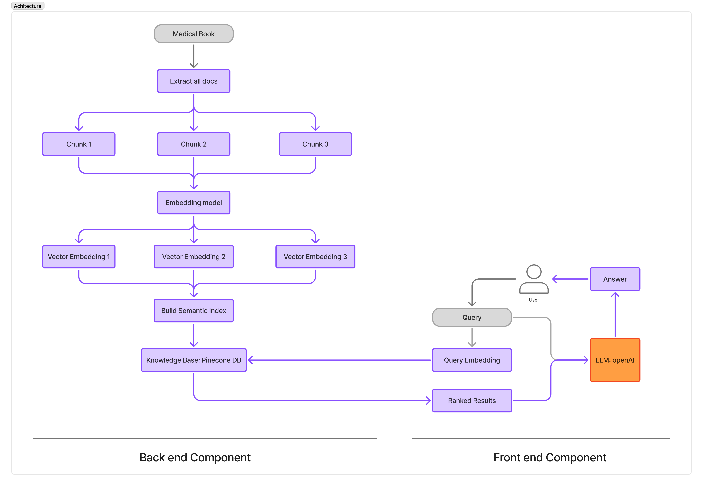
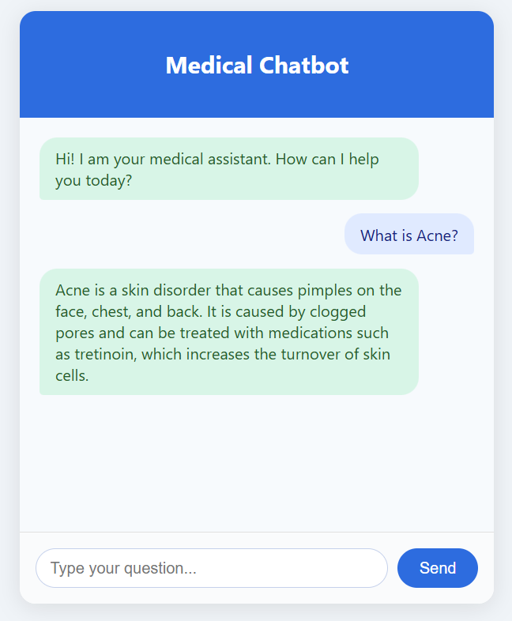
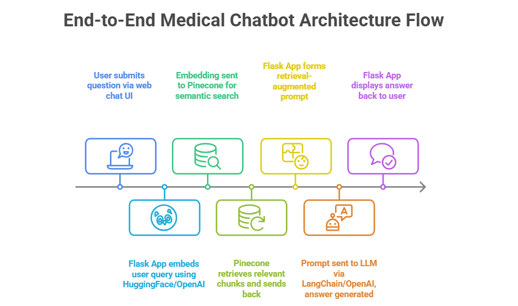
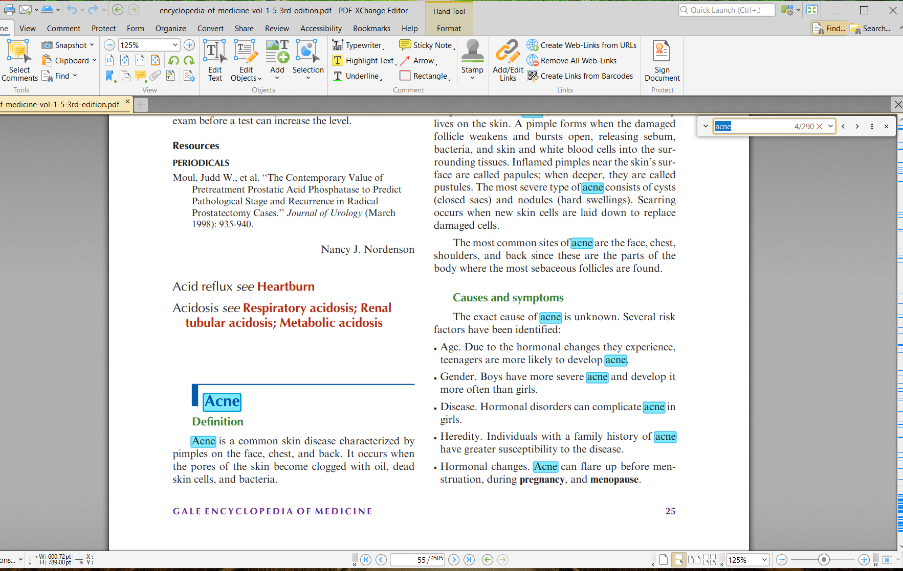
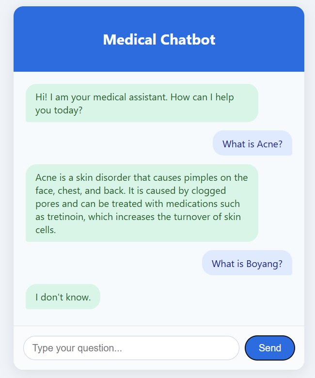

End-to-End Medical Chatbot
==============================# End-to-End Medical Chatbot

A modular, production-ready medical chatbot system built with Flask, LangChain, and Pinecone for semantic search and retrieval from medical documents.

---

## 🏗️ Architecture Flowchart

```mermaid
flowchart TD
    A[User (Web Chat UI)] -->|1. Sends Question| B[Flask App]
    B -->|2. Embeds Query| C[Embeddings (HuggingFace/OpenAI)]
    C -->|3. Semantic Search| D[Pinecone Vector DB]
    D -->|4. Retrieve Relevant Chunks| B
    B -->|5. Retrieval-Augmented Prompt| E[LLM (LangChain/OpenAI)]
    E -->|6. Answer| B
    B -->|7. Display Answer| A
    F[PDF Medical Docs] -->|Indexing: Load & Chunk| G[store_index.py]
    G -->|Embed Chunks| C
    C -->|Upsert Vectors| D
```

---

## 🖼️ Screenshots & Diagrams

### Solution Architecture


### Chatbot Web App Example


### Chatbot Architecture Flow


### Reference PDF Example


### Miscellaneous


---

## Overview
This project answers medical questions using information extracted from large PDF medical documents. It leverages:
- **Flask** for the web interface and API
- **LangChain** for document processing and retrieval-augmented generation (RAG)
- **Pinecone** as a vector database for fast semantic search
- **HuggingFace** or **OpenAI** embeddings for vectorization

**Features:**
- Upload and index medical PDFs
- Fast, accurate retrieval of relevant information
- Modular codebase for easy extension
- Secure API key management via `.env`

## 📁 Project Structure

```
end-to-end-medical-chatbot/
├── app.py                # Flask web server and API
├── store_index.py        # Document loading, embedding, and Pinecone upsert
├── src/
│   ├── helper.py         # Helper functions (embedding, PDF loading, etc.)
│   └── prompt.py         # Prompt templates
├── data/                 # Place your PDF files here
├── templates/
│   └── chat.html         # Frontend UI
├── docs/                 # Sphinx documentation
├── .env                  # Environment variables (not committed)
├── README.md             # Project overview and usage
├── pyproject.toml        # Poetry configuration
├── poetry.lock           # Poetry lock file
├── notebooks/            # (Optional) Jupyter notebooks for experiments
└── reports/              # (Optional) Generated analysis and figures
```

---

## 👩‍💻 How to Use This Project (For New Users)

1. **Clone the repository**
    ```bash
    git clone https://github.com/boyangwan12/end-to-end-medical-chatbot.git
    cd end-to-end-medical-chatbot
    ```

2. **Install dependencies** (requires [Poetry](https://python-poetry.org/docs/#installation))
    ```bash
    poetry install
    ```

3. **Set up your environment variables**
    - Copy `.env.example` to `.env` (if provided) or create a new `.env` file:
      ```
      PINECONE_API_KEY=your-pinecone-key
      OPENAI_API_KEY=your-openai-key  # if using OpenAI embeddings
      ```

4. **Add your medical PDFs**
    - Place your PDF files in the `data/` directory.

5. **Index your documents**
    ```bash
    poetry run python store_index.py
    ```
    - This will split your PDFs, generate embeddings, and upsert them to Pinecone.

6. **Run the chatbot web app**
    ```bash
    poetry run python app.py
    ```
    - Open [http://127.0.0.1:8080/](http://127.0.0.1:8080/) in your browser to access the chatbot UI.

7. **Ask questions!**
    - Type a medical question in the chat. The app will retrieve relevant info from your PDFs and generate an answer using an LLM.

---

**Tips:**
- For development, edit code in `src/` and rerun the relevant scripts.
- Keep your API keys safe! Never commit `.env` to version control.
